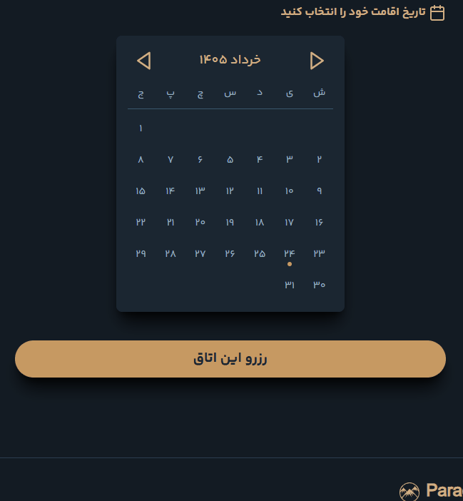

# Lightweight React/Next.js Components

مجموعه‌ای از کامپوننت‌های سبک و قابل سفارشی‌سازی برای **React** و **Next.js** که با **TypeScript** نوشته شده‌اند و استایل اولیه آن‌ها با **TailwindCSS** پیاده‌سازی شده است.

## ✨ ویژگی‌ها

- سبک و بهینه
- بدون وابستگی‌های سنگین
- قابل سفارشی‌سازی
- سازگار با React و Next.js
- نوشته شده با TypeScript

---

# 🗓️ Calendar

تقویم شمسی با قابلیت انتخاب چندگانه تاریخ.

```bash
npm i date-fns-jalali
```

### Preview

<p align="center">
  
</p>

### Usage

```tsx
import Calendar from '@/components/Calendar';

export default function Page() {
  return <Calendar />;
}
```

---

# 🖼️ ImageSlider

اسلایدر خودکار تصاویر با افکت‌های ساده و سبک.

### Preview

<p align="center">
  
</p>

### Usage

```tsx
<ImageSlider images={images} />
```

---

# 🖼️ ImageSwiper

سوایپر دستی تصاویر با دکمه‌های قبلی و بعدی.

### Preview

<p align="center">
  
</p>

### Usage

```tsx
<ImageSwiper images={images} />
```

---

`استار فراموش نشه :)`
